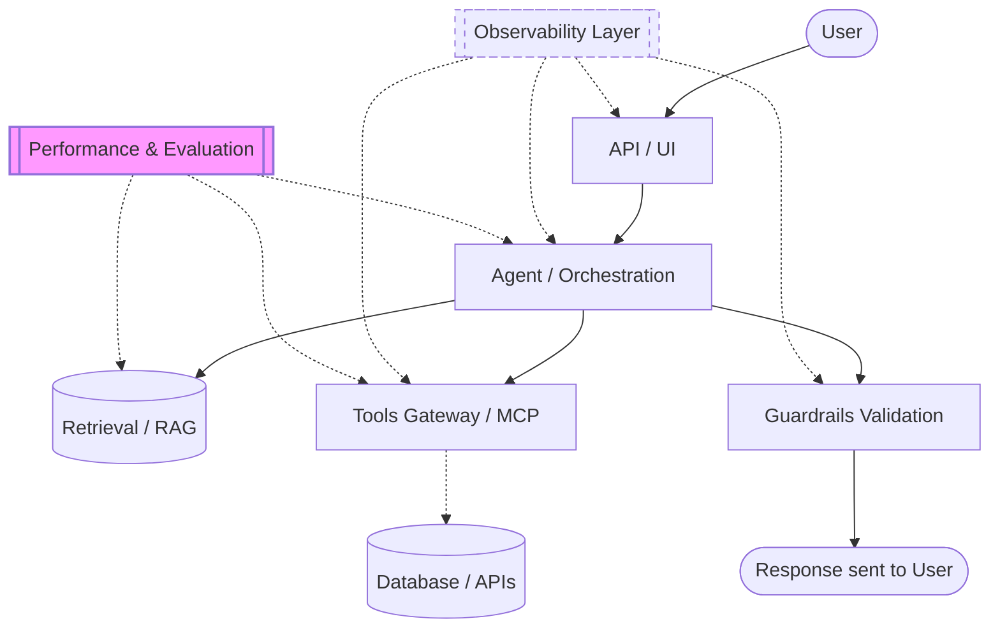

# Enterprise AI Architecture

Typical stack at large enterprises:

1. **Interface Layer**: API/UI (e.g., FastAPI, Next.js) where user interaction begins.
2. **Agent / Orchestration Layer** (`projects/multi_agent/`, `projects/research_agent/`): Handles complex workflows, planning, and task distribution among specialized AI agents.
3. **Retrieval Layer** (`projects/rag_system/`): Implements RAG (Retrieval-Augmented Generation) to ground LLMs with enterprise data using vector search.
4. **Tool Gateway Layer** (`mcp-gateway/`): An MCP-style centralized hub managing agent authentication, routing, and access to external capabilities securely.
5. **Guardrails Layer** (`projects/guardrails/`): Validates inputs/outputs, preventing prompt injections and enforcing compliance.
6. **Observability Layer** (`projects/observability/`): Tracks AI-specific telemetry like token usage and multi-agent execution paths.
7. **Performance & Evaluation Layer** (`projects/ai_perf_eval/`): Core production infrastructure for tracking Cost, Accuracy (RAGAS), and high-concurrency Load Testing (k6).
8. **Cloud Infrastructure** (`infra/terraform/`): Base infrastructure, typically leveraging Azure OpenAI, container apps, and robust CI/CD (`tests/`).

## User Flow

## Phase 4: Production Readiness Roadmap

1. **Advanced Evals**: Moving beyond latency to track **$$ Cost** and **Accuracy** using LLM-as-a-Judge patterns.
2. **Stress Testing**: Using `k6` to validate the `resilient_gateway` under enterprise-scale concurrency.
3. **Identity & Auth (NHI)**: Implementing Non-Human Identity patterns for agents interacting with secure tools.
4. **RAI & OWASP**: Aligning Guardrail policies with the **OWASP Top 10 for LLMs**.
