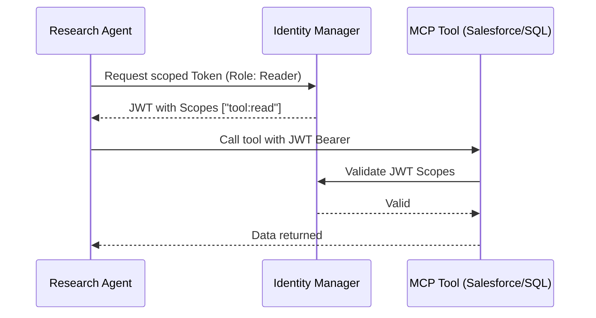

# Non-Human Identity (NHI) & Agent Auth Pattern

In enterprise AI ecosystems, agents are **Non-Human Identities (NHI)**. They must interact with tools, databases, and APIs using their own scoped credentials rather than shared administrative keys.

## 🏛 The NHI Architecture Pattern

## 🛠 Strategic Recommendations

### 1. Scoped MCP Tool Access
- **Current State**: MCP tools often use a single environment variable for API keys.
- **Phase 4 Pattern**: Update the `mcp_gateway` to accept a `Bearer Token` in the header, which is then mapped to the calling agent's specific permissions.

### 2. Ephemeral Credentials
- **The Workflow**: Agents should not store long-lived keys. Instead, use a "Short-lived Secret" pattern where the agent requests a temporary credential from a vault (e.g., Azure Key Vault or HashiCorp Vault) for the duration of a specific session.

### 3. Identity-Aware Logging
- **The Hub**: Every call to the `resilient_gateway` should include an `Agent-ID` header.
- **The Value**: This allows for "Agent Auditing," where you can track which specific agent version caused a security incident or high cost.

## 🚀 Future Implementation Tasks
- [ ] Add `Agent-ID` header validation in `projects/resilient_gateway`.
- [ ] Implement a `TokenFactory` in `packages/core` to simulate secure JWT generation for agents.
- [ ] Update `mcp_gateway` to support OAuth2 flow for tool authorization.
