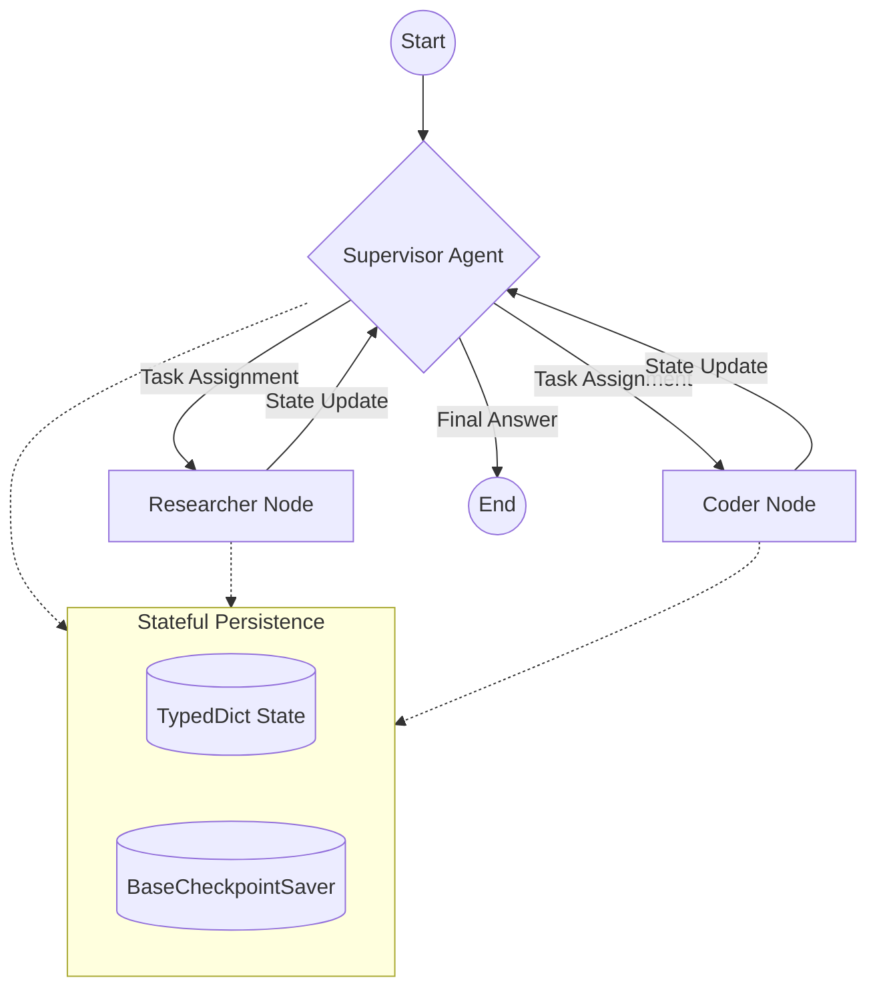

# CASE STUDY: MaxAI – Enterprise Agentic Orchestration for Document Automation

**Role:** Principal AI Architect / Lead Engineer  
**Focus:** RAG, Multi-Agent Systems, LLMOps, Enterprise Scalability  
**Stack:** LangGraph, Azure OpenAI, Python/FastAPI, Cosmos DB (Vector Search), OpenTelemetry, Kubernetes  

---

## Executive Summary
MaxAI was designed to solve the "Chatbot Plateau"—the point where simple RAG systems fail to handle complex, multi-step business logic. I architected and delivered a stateful, multi-agent platform that transitioned the organization from basic Q&A to autonomous document-centric workflows. By leveraging LangGraph for orchestration and OpenTelemetry for observability, the system achieved a **20% increase in data retrieval accuracy** and a **30% improvement in system reliability.**

---

## 1. The Challenge
Standard RAG pipelines are typically linear: *Retrieve -> Augment -> Generate.* However, enterprise scenarios (like the document auditing required in Pharma or Mortgage industries) require **reflection, self-correction, and tool-specialization.** 

The goal was to build a system that could:
1.  Handle complex, multi-modal document tasks.
2.  Maintain conversation state across long-running autonomous tasks.
3.  Provide full observability into the "thought process" of the AI for auditability.

---

## 2. High-Level Architecture
I implemented a **Supervisor-specialist pattern**. Instead of one giant prompt, a central "Supervisor" node manages the state and routes tasks to specialized worker agents.

---

## 3. Technical Deep-Dive

### A. Stateful, Cyclic Orchestration (LangGraph)
Unlike traditional DAGs, I used **LangGraph** to allow for **cycles**. If the `Coder` node produces an error, the `Supervisor` can route the state back to the `Researcher` to gather more context. 
*   **State Management**: Used a robust `TypedDict` to track message history, tool outputs, and routing flags across nodes.
*   **Human-in-the-Loop**: Integrated approval gates for high-stakes actions (e.g., final document submission), ensuring the AI works *with* experts, not just alongside them.

### B. LLMOps & Observability (OpenTelemetry)
A primary challenge in agentic systems is "The Black Box." To solve this, I implemented comprehensive tracing:
*   **ObservabilityClient**: Built a custom client integrated with **OpenTelemetry** to log every node transition, tool call, and token usage unit.
*   **Trace IDs**: Mapped unique `trace_id` and `span_id` to every multi-agent run, allowing SRE teams to debug latency spikes in specific nodes (e.g., identifying when a vector DB query was the bottleneck).

### C. Security & Guardrails
Built a multi-layered security stack to ensure enterprise compliance:
*   **PII Filtering**: Automated sanitization of sensitive data before reaching the LLM.
*   **Prompt Injection Mitigation**: Implemented semantic validation of user inputs to prevent jailbreaking of the supervisor system.

---

## 4. Engineering Rigor & Deployment
As a Principal Leader, I focused on the "Production-First" mindset:
*   **Infrastructure as Code**: Managed the entire Azure stack (App Services, Cosmos DB, Key Vault) using **Terraform**.
*   **Containerization**: Orchestrated the microservices using **Kubernetes (AKS)** and **Helm**, allowing for independent scaling of the Researcher and Coder workers.
*   **CI/CD**: Implemented automated testing for LLM outputs to measure "drift" and "hallucination" during deployment cycles.

---

## 5. Business Results & Impact
*   **Accuracy**: Improved RAG query relevance by **10%** and context-aware response accuracy to **95%** through embedding tuning.
*   **Latency**: Reduced end-to-end task completion time by **25%** through optimized batching and sharding of the vector database.
*   **Automation**: Successfully automated **30%** of previous manual document decision-making processes, mirroring my previous successes in the mortgage sector.

---

## Conclusion
MaxAI demonstrates that the true value of an AI Architect isn't just in the model selection, but in the **orchestration and engineering** that surrounds it. This project serves as a blueprint for how Agentic AI can be safely and scalably deployed in high-compliance industries.
