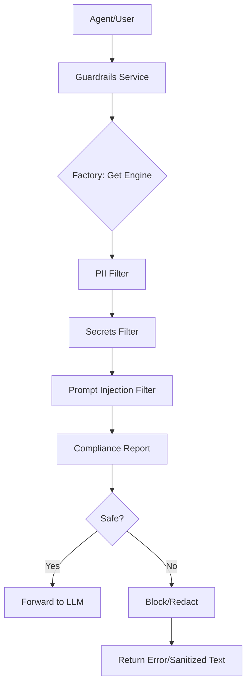

# LLM Guardrails: Security & Compliance Architecture

This service acts as a defensive perimeter around Large Language Models, ensuring that all interactions comply with organizational security policies.

## Core Design

### 1. Interception Strategy
The service is designed to be called as a middleware or proxy before reaching any LLM provider. 
- **Input Guarding**: Analyzes user prompts for malicious intent (Injection) or sensitive data (PII).
- **Output Guarding**: Sanitizes model completions before they are displayed to the user.

### 2. Guardrail Factory (`app/services/factory.py`)
Following the project's standard pattern, we use an **Abstract Factory** to instantiate validation engines:
- **`SimpleRegexEngine`**: A fast, deterministic engine using pattern matching for common PII and secrets.
- **`LLMAnalysisEngine`** (Placeholder): Intended for using a small, specialized LLM (like Llama-Guard) to detect subtle semantic violations.

### 3. Auditing & Logging
Every validation request is captured by a specialized middleware:
- Logs the violation type (if any).
- Captures latency to ensure security doesn't significantly impact user experience.
- Outputs structured `GUARDRAIL_AUDIT` logs for SIEM integration.

## Component Flow

## Policy Implementation
- **PII**: Detects and redacts emails and phone numbers.
- **Secrets**: Blocks patterns matching common API Key formats (OpenAI, AWS).
- **Injection**: Blocks "Jailbreak" attempts that try to override system instructions.
