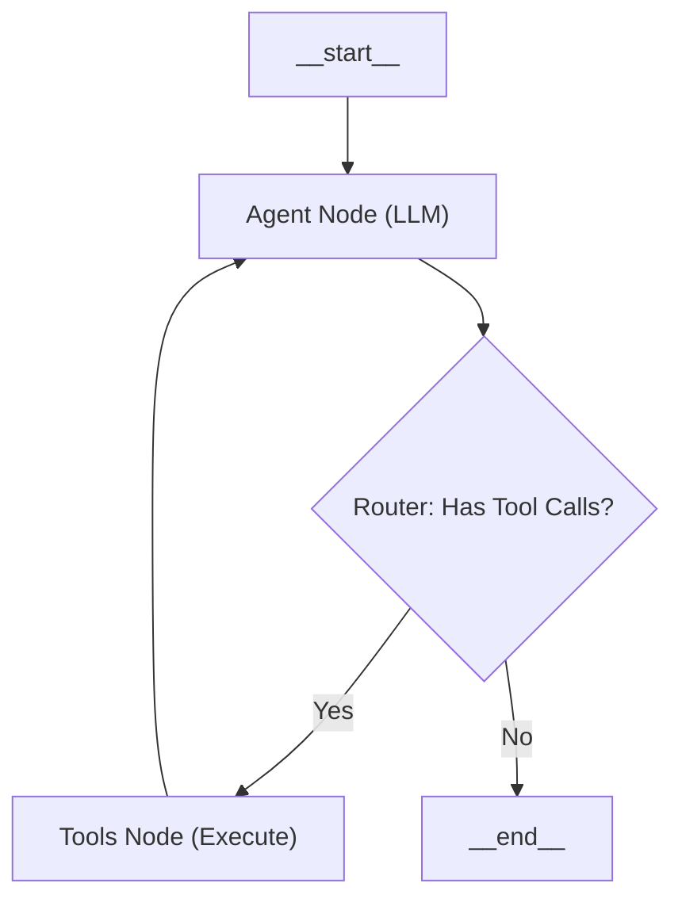

# Technical Interview Preparation: InsureDoc AI

This document serves as a repository for high-level technical explanations of the **InsureDoc** platform, specifically tailored for senior-level AI Engineering interviews.

---

## 1. Orchestrator Service: Agentic Workflow (LangGraph)

### ❓ Question: 
"Can you explain the architecture of your AI Orchestrator? Why did you choose a graph-based approach over a simple linear chain?"

### 💻 The Code Context
```typescript
const workflow = new StateGraph(MessagesAnnotation)
  .addNode('agent', async (state: typeof MessagesAnnotation.State) => {
    const model = getModel();
    const result = await model.invoke(state.messages);
    return { messages: [result] };
  })
  .addNode('tools', new ToolNode(tools))
  .addEdge('__start__', 'agent')
  .addConditionalEdges('agent', (state) => {
    const lastMsg = state.messages[state.messages.length - 1];
    return (lastMsg as any).tool_calls?.length ? 'tools' : '__end__';
  })
  .addEdge('tools', 'agent');

export const app = workflow.compile();
```

### 📊 The Agentic Loop (Visualized)



### 🎙️ The "Senior Engineer" Pitch
"In this service, I implemented a **cyclic agentic workflow** using **LangGraph**. Unlike a standard linear chain, this architecture allows the AI to enter a loop where it can reason, call tools, observe results, and then re-reason until the final goal is met."

#### **Key Talking Points:**

1.  **State-Driven Architecture (`MessagesAnnotation`)**
    *   Explain how the state is a persistent, append-only history of the conversation. Every node reads from and writes to this global state, ensuring context is never lost during tool-calling hops.

2.  **The Thought-Action Loop**
    *   **The `agent` node**: Acts as the 'brain,' deciding which path to take.
    *   **The `tools` node**: Acts as the 'hands,' executing functions like `checkClaimStatus` or `searchInsurancePolicy`.

3.  **Reactive Routing (`addConditionalEdges`)**
    *   This is the 'intelligence' of the graph. We use a router function to inspect the model's output.
    *   **How it works**: When we bind tools to the **Azure OpenAI (GPT-4o)** model, it gains the ability to return structured `tool_calls` instead of just plain text.
    *   The router checks if these `tool_calls` exist. If they do, we route to the Tools node. If not, we route to `__end__`. This enables 'self-healing' flows where an agent can retry a search if the first one yields no data.

4.  **Observability and Diagnostics**
    *   By decomposing the flow into discrete nodes, we gain granular observability. We can log precisely when an AI 'Identifies a Tool Call' versus when it 'Retrieves Data,' which I then visualized in the frontend reasoning trace.

> [!TIP]
> **Interviewer Pro-Tip**: Mention that this architecture is 'Multi-Agent Ready.' If we wanted to add a specialized 'Claims Auditor' agent or a 'Policy Expert' agent, we would simply add more nodes and edges to this existing graph.

---

## 3. Tool Discovery & Binding Strategy

### ❓ Question: 
"How does the Azure OpenAI model know which specific tools are available and when to call them?"

### 💻 The Code Context
```typescript
const searchInsurancePolicy = new DynamicStructuredTool({
  name: 'searchInsurancePolicy',
  description: 'Use this tool to search through insurance benefit booklets.',
  schema: z.object({
    query: z.string().describe('The dental procedure or benefit to lookup.'),
  }),
  func: async ({ query }) => { ... }
});

// BIND the tools to the model
const model = new ChatOpenAI({ ... }).bind({
  tools: [searchInsurancePolicy, checkClaimStatus]
});
```

### 🎙️ The "Senior Engineer" Pitch
"The model doesn't 'discover' tools at runtime; we explicitly **inject their definitions** into the model's specialized context. It's a two-part process involving **Structured Schemas** and **Description-Based Inference**."

#### **Key Talking Points:**

1.  **JSON Schema Injection**
    *   "When we call `.bind({ tools })`, LangChain converts our TypeScript/Zod definitions into a standard **JSON Schema**. This schema includes the tool's name, a natural language description, and the exact data types for its arguments. This is sent to the Azure OpenAI API as part of the hidden system instructions."

2.  **Semantic Match-Making**
    *   "Inside the LLM (GPT-4o), there is an attention mechanism that compares user intent against these tool descriptions. If I ask 'What does my policy say about crowns?', the model sees the description for `searchInsurancePolicy` and identifies a high semantic match."

3.  **Structured Output Generation**
    *   "Instead of returning text, the model returns a structured JSON object if it selects a tool. It populates the arguments (like the `query` string) based on the user's input."

4.  **System-Level Constraints**
    *   "Crucially, the LLM doesn't *execute* the code. It simply returns the **intent to call**. Our LangGraph orchestrator then receives this intent and is responsible for actually executing the function."

> [!TIP]
> **Interviewer Pro-Tip**: Mention that **descriptions are code**. In Agentic AI, a better tool description is often more effective than more training data. If a model is calling the wrong tool, the first thing a Senior Engineer does is refine the natural language description in the tool definition.

---

## 4. Resilience and Self-Healing (Tool Error Handling)

### ❓ Question: 
"If a tool fails—for example, if the Qdrant database is down—how does your system prevent the entire agent loop from crashing?"

### 🎙️ The "Senior Engineer" Pitch
"In an agentic system, **errors are just another type of data**. Instead of letting tool exceptions bubble up and crash the Node.js process, we 'trap' the error and feed it back into the model's state as a `ToolMessage`."

#### **Key Talking Points:**

1.  **Error Trapping (The Wrapper Pattern)**
    *   "Instead of raw function calls, I ensure every tool is wrapped in error handling. If a database or API call fails, the tool returns a string like: `'ERROR: Database unreachable. Suggest the user retry in 5 minutes.'`"

2.  **Feedback Loops via ToolMessages**
    *   "Because the error is returned as a string, it is appended to the `MessagesAnnotation` as a `ToolMessage`. The graph then logically routes back to the `agent` node."

3.  **LLM-Driven Self-Correction**
    *   "The LLM now sees the error in its history. Because it is the orchestrator, it can intelligently decide the next move: it can apologize, explain the technical issue in plain English, or even try a different tool as a fallback."

4.  **Circuit Breakers and Loop Limits**
    *   "To prevent the AI from endlessly retrying a failing tool, we configure the `recursion_limit` on the graph compilation. This acts as a hard stop to prevent runaway loops and cost spikes."

> [!TIP]
> **Interviewer Pro-Tip**: Mention that this approach is the **"Circuit Breaker"** pattern for AI. By converting technical exceptions into natural language feedback, we leverage the LLM's reasoning capability to handle transient failures gracefully.

---

## 5. Vector Indexing and Retrieval (Qdrant & RAG)

### ❓ Question: 
"Can you walk me through the 'under the hood' vector indexing process? Also, how does Qdrant handle Semantic Similarity differently than a traditional Keyword search?"

### 💻 The Code Context
```typescript
// Part 1: Chunking & Embedding
const chunks = splitTextIntoChunks(pdfText, 500, 50); // 500 tokens, 50 overlap
const vector = await azureOpenAI.getEmbeddings(chunk); // 1536-dim vector

// Part 2: Qdrant Indexing
await qdrant.upsert('insurance-policies', {
  id: uuid(),
  vector: vector,
  payload: { text: chunk, procedureCode: 'D2740' }
});
```

### 🎙️ The "Senior Engineer" Pitch
"The indexing process is essentially a transformation from **Natural Language** to **High-Dimensional Geometry**. Traditional searches look for matching 'words,' while our system looks for matching 'concepts' by measuring the mathematical distance between vectors."

#### **Key Talking Points:**

1.  **The Indexing Pipeline (HNSW Graph)**
    *   "The process starts with **Semantic Chunking**. We use a 50-token overlap to ensure context isn't lost at chunk boundaries.
    *   Next, Azure OpenAI's `text-embedding-3-small` generates a mapping in 1536-dimensional space.
    *   **Under the hood**, Qdrant builds an **HNSW Index (Hierarchical Navigable Small World)**. This is a graph-based indexing algorithm that allows for $O(\log N)$ search speed. Instead of comparing the query against every document, the algorithm 'traverses' the graph toward the most similar neighbor."

2.  **Semantic Similarity (Dense Vectors)**
    *   "We use **Cosine Similarity** to quantify meaning. If a user asks about 'Capping a tooth,' the search will find documents discussing 'Crowns' because they represent the same medical concept in vector space, even if the keywords are different."

3.  **Scalar Filtering (Payload Match)**
    *   "Qdrant isn't just a vector store; it's a **Hybrid Engine**. We use 'Payloads' to store scalar data like procedure codes. This allows us to perform a 'Pre-filtered Vector Search.' For example, we can tell Qdrant: 'Only perform a semantic search on documents that have the metadata attribute procedure=D2740.' This eliminates noise and improves accuracy dramatically."

> [!TIP]
> **Interviewer Pro-Tip**: Mention **"Retrieval Precision"**. In dental insurance, accuracy is non-negotiable. I tuned the chunk size specifically to handle the structure of insurance booklets, ensuring that procedure rules and their exclusions are always retrieved together.

---

## 6. Real-Time Streaming UI (SSE Logic)

### ❓ Question: 
"Why did you choose Server-Sent Events (SSE) for your AI responses, and how do you handle the potential for 'double text' or 'mangled JSON' when streaming?"

### 🎙️ The "Senior Engineer" Pitch
"For AI-powered chat, **unidirectional streaming** is almost always superior to WebSockets because it's lighter on the server and works natively over standard HTTP. The real challenge is managing the **incremental data state** in the frontend without causing UI glitches."

#### **Key Talking Points:**

1.  **SSE vs. WebSockets**
    *   "I chose SSE because AI responses are inherently unidirectional. It's built on standard HTTP using the `text/event-stream` content type, which avoids the overhead of a stateful WebSocket connection and plays much nicer with modern serverless or load-balanced environments."

2.  **State Immutability (The 'Double Text' Fix)**
    *   "Streaming in React is tricky because of the re-render cycles. To prevent duplicate text rendering, I use a functional state update that **clones** the previous message object before appending new characters. This ensures that even if React calculates a re-render twice (like in Strict Mode), the 'delta' is only applied once."

3.  **Partial Chunk Buffering**
    *   "Network packets don't always arrive as complete JSON objects. I implemented a **Reader Buffer** in the frontend that accumulates raw bytes until a full newline (`\n`) is detected. This prevents the `JSON.parse` from failing when a data frame is split across two TCP packets."

---

## 7. Security and JWT Architecture

### ❓ Question: 
"How do you secure your AI agent's tools? What prevents an unauthorized user from making expensive LLM calls or accessing private claim data?"

### 🎙️ The "Senior Engineer" Pitch
"Security in an Agentic AI system must be enforced at the **Orchestrator level**. I implemented a **Bearer Token (JWT)** validation layer that sits in front of every sensitive endpoint, ensuring that only authenticated identities can trigger a tool call."

#### **Key Talking Points:**

1.  **Stateless Bearer Authentication**
    *   "We use standard JWTs for authentication. The Orchestrator service acts as the 'Security Gateway.' Before any agent node is executed, the `validateEntraToken` middleware verifies the digital signature of the token against our identity provider."

2.  **Environment-Specific Security (Bypass Logic)**
    *   "For local development and rapid iteration, I built a `AZURE_AUTH_BYPASS` flag. This allows us to mimic authenticated sessions without constant token refreshing, while keeping the **exact same middleware structure** that we'll use in the AKS production environment."

3.  **Microservice Isolation**
    *   "The architecture is designed for 'Defense in Depth.' While the Orchestrator handles external security, the internal microservices (Ingestion, Claim) live in a private virtual network. In a full production setup, we'd further harden this using **Private Links** in Azure, ensuring that the database containers are never exposed to the public internet."

---

## 8. Adaptive Chunking vs. Generic Libraries

### ❓ Question: 
"Why build a custom `ChunkingService`? Why not just use a generic library like LangChain's default splitters?"

### 🎙️ The "Senior Engineer" Pitch
"Generic libraries treat all text the same. In the dental insurance domain, a generic chunker might split a 'Procedure Table' right down the middle, separating a code from its requirement. I built an **Adaptive Chunking Service** that understands the **semantic structure** of insurance documents."

#### **Key Talking Points:**

1.  **Adaptive Token Windows (The 256 vs. 512 rule)**
    *   "Our service uses **Conditional Logic** based on content. When we detect keywords like `'procedure code'`, we automatically shrink the chunk size to 256 tokens. Why? Because procedure rules are dense and precise. We want to ensure the LLM gets multiple procedure options in its limited context window, rather than one giant block of text."

2.  **Semantic Boundary Awareness**
    *   "Generic libraries split by character count or double newlines. Our service identifies **Document Headings**. It attempts to chunk text into discrete 'Sections' (like 'Exclusions' vs. 'Coverage'). This ensures that a rule is never retrieved without its corresponding heading, which provides the necessary context for the LLM."

3.  **Token-Perfect Counting (`Tiktoken`)**
    *   "Simple libraries count characters. Our service uses the **exact same tokenizer as GPT-4o (`cl100k_base`)**. This means our 512-token chunk is exactly 512 tokens in the LLM's brain. This prevents the 'Truncation Error' where a message is cut off because the character count didn't account for complex tokens."

4.  **Metadata Enrichment**
    *   "A library just gives you text. Our service builds a **Heading Path** (e.g., `[Benefits, Crowns, Exclusions]`). We inject this metadata into every chunk before it hits Qdrant. This allows the AI to say: 'According to the **Exclusions** section of **Crowns**...', which builds massive user trust."

> [!TIP]
> **Interviewer Pro-Tip**: Mention the **"Last Mile" problem**. In AI, the 'Last Mile' is ensuring the data the LLM sees is clean and relevant. By building a custom chunker, we control the most important variable in the entire RAG pipeline: the quality of the retrieved context.

---

## 9. The AI Infrastructure (Azure OpenAI)

### ❓ Question: 
"Why did you choose Azure OpenAI for both the LLM and the Embeddings service, instead of using open-source local models like Llama or Mistral?"

### 🎙️ The "Senior Engineer" Pitch
"In the insurance industry, **Security and Reliability are first-class requirements**. While open-source models are great for experimentation, I chose Azure OpenAI for **InsureDoc** to ensure enterprise-grade data privacy, high-availability SLAs, and seamless integration with a secure virtual network."

#### **Key Talking Points:**

1.  **Unified Semantic Space**
    *   "By using `gpt-4o` for the LLM and `text-embedding-3-small` for embeddings within the same ecosystem, I ensure that the **semantic mapping is consistent**. This reduces 'retrieval drift' and ensures that the model can perfectly interpret the 1536-dimensional vectors created during ingestion."

2.  **Data Privacy and Compliance**
    *   "In healthcare and insurance, we cannot risk customer data being used for public model training. Azure's OpenAI service provides a **zero-retention policy** for the data sent to their models, ensuring that our claims data remains isolated and compliant with insurance industry standards."

3.  **Production-Grade SLAs**
    *   "Self-hosting a low-latency LLM with high throughput requires massive GPU overhead and complex DevOps. By leveraging Azure's managed service, I can focus the team's effort on **Agentic Logic (LangGraph)** and **Data Retrieval (Qdrant)**, while Azure handles the scaling and hardware orchestration."

4.  **Network Isolation (Private Link)**
    *   "Azure OpenAI allows us to use **Private Endpoints**. This means our AI traffic never crosses the public internet; it stays entirely within our secure virtual network. This 'Defense in Depth' strategy is a non-negotiable requirement for senior security architects when dealing with PI (Personal Information)."

> [!TIP]
> **Interviewer Pro-Tip**: Mention **"Time-to-Market vs. Operational Excellence."** Explain that as a Senior Engineer, your job is to balance build/buy decisions. Buying the 'AI Infrastructure' allowed us to build the 'Business Value' (the dental agent) in weeks instead of months of infrastructure tuning.

---

## 10. Advanced Ingestion: Azure AI Document Intelligence

### ❓ Question: 
"Your current system uses a PDF parser for booklets. How would you handle the ingestion of actual **Claim Forms** or **X-ray reports**, which are often scanned images or fixed-layout documents?"

### 🎙️ The "Senior Engineer" Pitch
"For unstructured manuals, RAG is king. But for **Structured Forms** (like an ADA Dental Claim Form), a basic PDF parser is insufficient. I would integrate **Azure AI Document Intelligence** to move from 'Text Extraction' to 'Semantic Field Extraction'."

#### **Key Use Cases:**

1.  **Form Extraction (Key-Value Pairs)**
    *   "Instead of just getting a 'blob' of text, Document Intelligence uses pre-built models to identify specific fields: `PatientName`, `ProviderID`, `TotalBilled`. This allows us to populate our **MongoDB snapshots** with 100% accurate data from scanned images, which a standard LLM might struggle to parse reliably from a raw OCR dump."

2.  **Document Classification**
    *   "In a production 'Stuck Claim' workflow, users often upload a hodgepodge of files. I would use the **Classification Model** to automatically tag incoming documents: *'This is a Periodontal Chart,' 'This is a Digital X-ray,' 'This is a Narrative.'* Our agent can then use these tags to check if the specific missing documents required by the policy have been received."

3.  **Complex Table Reconstruction**
    *   "Insurance booklets contain nested co-pay tables that 'melt' when converted to plain text. Document Intelligence preserves the **HTML/Markdown structure of tables**. By feeding the LLM a clean Markdown table instead of a scrambled text string, we drastically reduce hallucinations when the agent is calculating out-of-pocket costs."

4.  **Layout-Aware Chunking**
    *   "By using the 'Layout' model, we can chunk research data by **Visual Boundaries** (sections, headers, and footers) rather than just character counts. This is the highest level of 'Adaptive Chunking' possible, as it respects the document's original design intent."

> [!TIP]
> **Interviewer Pro-Tip**: This is a great place to talk about **"Confidence Scores."** Document Intelligence provides a confidence score for every field it extracts. A Senior Engineer would implement a "Human-in-the-Loop" trigger: *"If the extraction confidence for the Procedure Code is < 90%, flag this claim for manual review instead of letting the AI process it automatically."*

---
