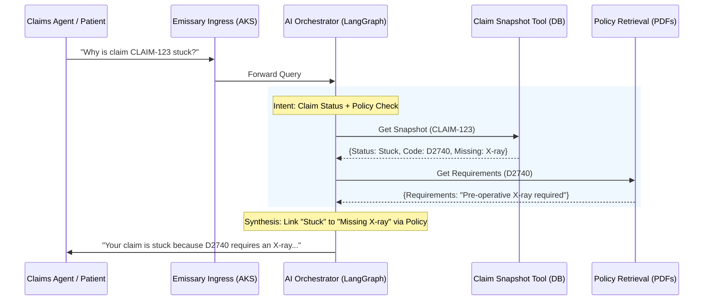

# InsureDoc: Dental AI Claims Assistant Overview

InsureDoc is a microservices-based AI platform designed for dental insurance providers to automate claim status inquiries and policy lookups. It mimics the **Structured State Retrieval** pattern used in enterprise platforms like `GOLD-AI-API`.

## 🔄 Business Process Flow

---

## 🏗️ Architectural Layers

### 1. Data Ingestion (The Continuous Learner)
- **Component**: `ingestion/adaptive-chunker.ts`
- **Function**: Automatically processes insurance manuals. 
- **Learning**: Configured via **Azure AI Search Indexers** to monitor Blob Storage. When a new benefit booklet is uploaded, the indexer triggers a re-sync, making the AI "learn" the new procedure rules immediately.

### 2. Structured State (The Live Data)
- **Component**: `claim-service/stuck-claim-tool.ts`
- **Logic**: Instead of searching PDFs for "why is it stuck," this tool provides **direct access to the Claim Database**. It returns the exact error codes and missing document flags that the LLM then explains to the user.

### 3. Orchestration (The Brain)
- **Component**: `orchestrator/agent.ts`
- **Technology**: **LangGraph** messages-state management.
- **Role**: Routes the user's question to the correct tool. If a user asks about a general procedure, it only hits the PDF cache. If they ask about *their* claim, it hits the Database.

---

## 🔐 Security & Operations (AKS)
- **Networking**: VNet-isolated spokes for Azure OpenAI and CosmosDB (Private Links).
- **Service Mesh**: Istio-managed mTLS between all Node.js microservices.
- **Authentication**: MSAL-verified identity tokens for all tool calls.
- **Observability**: OpenTelemetry spans from the Gateway through to the Tool execution.

---

## 🎯 Value Proposition
InsureDoc reduces human intervention in "Stuck Claim" tickets by providing the AI with the **exact same context** a human adjuster uses: the policy booklet and the live claim state.
