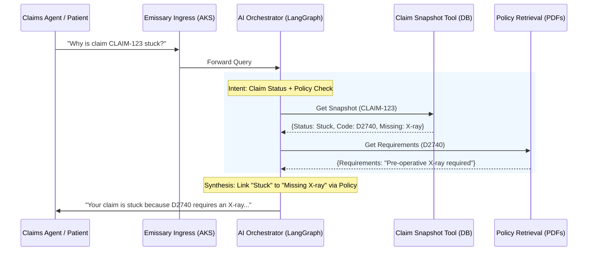

# InsureDoc: Dental AI Claims Assistant Overview

InsureDoc is a microservices-based AI platform designed for dental insurance providers to automate claim status inquiries and policy lookups. It mimics the **Structured State Retrieval** pattern used in enterprise platforms like `GOLD-AI-API`.

## 🔄 Business Process Flow

---

## 🏆 Final Project Summary

| Feature Area | Technical Stack | Key Capability |
| :--- | :--- | :--- |
| **Vector Search** | Azure OpenAI + Qdrant | **Live Retrieval**: Indexes policy booklets for instant search. |
| **Agentic Core** | LangGraph Orchestrator | **Multi-Step Reasoning**: Chooses between claims & policies. |
| **Streaming UI** | React + SSE | **Real-Time UX**: Interactive streaming with tool traces. |
| **Structured Entry** | Mongo + Premium Forms | **Data Lifecycle**: Integrated "Create -> Analyze" flow. |

---

## 🏗️ Architectural Layers

### 1. Data Ingestion (Vector Search)
- **Component**: `ingestion-service/server.ts`
- **Technology**: **Qdrant Vector Database**
- **Function**: Processes insurance manuals (PDFs) into semantic chunks and stores them as 1536-dimensional vectors for RAG retrieval.

### 2. Structured State (Claims Database)
- **Component**: `claim-service/stuck-claim-tool.ts`
- **Technology**: **MongoDB**
- **Logic**: Provides direct access to the live Claim Database. It returns the exact procedure codes, patient names, and status flags used for agentic analysis.

### 3. Orchestration (The Brain)
- **Component**: `orchestrator-service/agent.ts`
- **Technology**: **LangGraph** (State Management)
- **Role**: Determines the optimal path to resolve a query by dynamically invoking the Policy Search or Claim Lookup tools.

---

## 🔐 Security & Operations (AKS)
- **Networking**: VNet-isolated spokes for Azure OpenAI and CosmosDB (Private Links).
- **Service Mesh**: Istio-managed mTLS between all Node.js microservices.
- **Authentication**: MSAL-verified identity tokens for all tool calls.
- **Observability**: OpenTelemetry spans from the Gateway through to the Tool execution.

---

## 🎯 Value Proposition
InsureDoc reduces human intervention in "Stuck Claim" tickets by providing the AI with the **exact same context** a human adjuster uses: the policy booklet and the live claim state.
