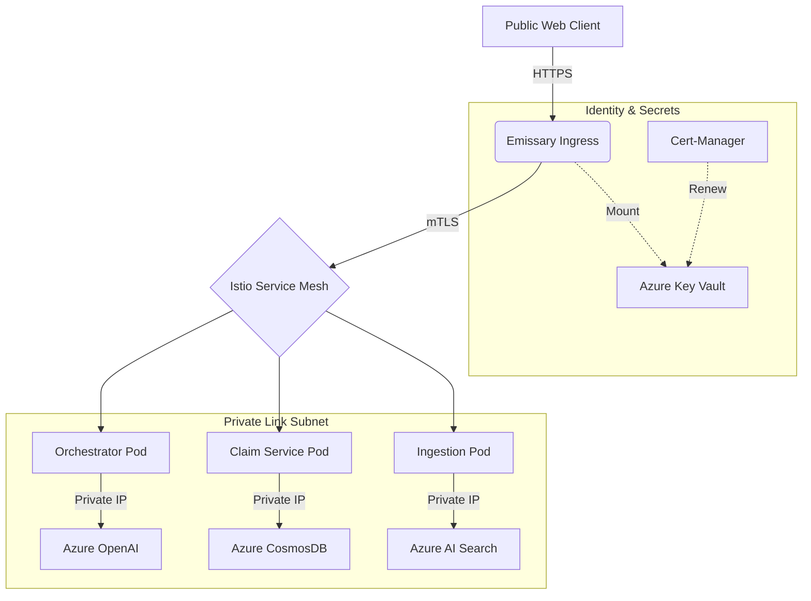

# InsureDoc: Enterprise Infrastructure & Security Roadmap

This document outlines the sequential steps to deploy the **InsureDoc** platform on Azure with a focus on **Zero-Trust Networking** and **Automated Identity**.

---

# First login to azure using az login and select the subscription
az account show
az logoff
az login

## 🏗️ Phase 1: The Bootstrap (State Management)
**Goal**: Create a secure, remote "vault" for your Terraform state.
- **What**: An Azure Storage Account with Blob versioning.
- **Why**: Essential for team collaboration and to prevent local state corruption.
- **How**:
  1. Run `scripts/setup-backend.sh`.
  2. Take the output and paste it into `terraform/backend.tf`.
  3. Export the `ARM_ACCESS_KEY` provided by the script.

## 🛡️ Phase 2: The Foundation (Terraform + Private Link)
**Goal**: Provision the core infrastructure with hardware-level security.
- **What**: AKS (Managed Istio), Key Vault, CosmosDB, and Azure AI Search.
- **Why**: **Private Link** ensures that your AI data (Patient records, Policy PDFs) never travels over the public internet. All traffic stays within your Azure VNet.
- **How**:
  1. `cd terraform`
  2. `terraform init`
  3. `terraform apply`

## 🌉 Phase 3: The Edge (Emissary + Key Vault CSI)
**Goal**: Secure the "Front Door" (North-South Traffic).
- **What**: Emissary Ingress using the **Secret Store CSI Driver**.
- **Why**: Instead of storing TLS certificates as K8s secrets (base64 encoded), we "mount" them directly from **Azure Key Vault**.
- **How**:
  1. Deploy the `SecretProviderClass` manifest.
  2. Configure Emissary `Listener` to use the mounted certificate.

## 🕸️ Phase 4: Zero Trust (Istio / Mutual TLS)
**Goal**: Secure internal communication (East-West Traffic).
- **What**: **Azure Managed Istio Addon**.
- **Why (Managed)**: You get automatic patching and Azure support for the mesh. No need to manage `istiod` manually.
- **How (Managed)**: Enabled via `service_mesh_profile` in Terraform.
- **How (Manual)**: If you ever migrate off the addon, you would run:
  ```bash
  helm install istio-base istio/base -n istio-system --create-namespace
  helm install istiod istio/istiod -n istio-system
  ```

## 📜 Phase 5: Automated Certificates (Cert-Manager)
**Goal**: Automation of life-cycles for TLS.
- **What**: **Cert-Manager** with an Azure Key Vault issuer.
- **Why**: Automatically renews certificates in Key Vault and notifies Emissary.
- **How**:
  1. Deploy Cert-Manager via Helm.
  2. Create a `ClusterIssuer` pointing to your Azure Key Vault.

---

## 🔄 Interaction Diagram (Signavio Style)


