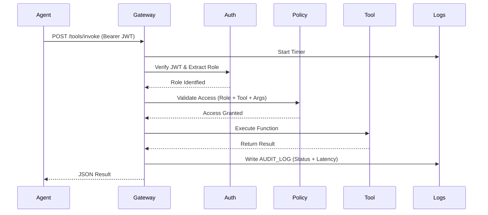

# MCP Gateway Architecture: Governance & Security Layer

This document outlines the architecture of the Model Context Protocol (MCP) Gateway. The gateway acts as a controlled entry point for agents to access institutional tools and data safely.

## Core Design Principles

1. **Governance First**: Every tool execution must be authorized by a central policy engine.
2. **Identity & Accountability**: All requests are authenticated via JWT, and every action is logged for auditing.
3. **Environment Isolation**: The gateway runs in a Dockerized environment with restricted filesystem access.
4. **Extensibility**: Adding new tools is as simple as registering them in the `TOOL_REGISTRY`.

## Component Lifecycle

### 1. Authentication (`app/auth.py`)
- Uses **JWT (JSON Web Tokens)** to verify caller identity.
- Encodes roles (e.g., `admin`, `analyst`, `engineer`) directly into the token payload.
- Integrated with FastAPI's `OAuth2PasswordBearer` for industry-standard token handling.

### 2. Policy Engine (`app/policy_engine.py`)
- Separates "Can I run this?" logic from the tool's implementation.
- Supports **RBAC** (Role-Based Access Control) and **ABAC** (Attribute-Based Access Control).
- Example: Prevents path traversal by validating tool arguments before they reach the OS layer.

### 3. Audit Logging (Middleware in `app/main.py`)
- A centralized middleware that intercept all tool invocation requests.
- Logs critical metadata: caller ID, tool name, arguments, status code, and latency.
- Outputs structured logs for easy ingestion into observability dashboards.

### 4. Tool Registry (`app/tools.py`)
- A dictionary-based registry mapping tool names to Python functions.
- Provides a clean interface for adding new capabilities without modifying core routing logic.

## Request Flow

## Security Model

- **Filesystem**: The gateway is restricted to a specific `BASE_ALLOWED_DIR`.
- **Read-Only**: Docker mounts are ideally read-only where possible to prevent agents from modifying the host system.
- **Static Analysis**: The code uses type hinting and pydantic models to ensure input data integrity.
