# Types of ML Systems

This document is the starting point for your new machine learning project. It focuses on the major **types of ML systems**, how they learn, when to use them, and how to think about them before you start building.

Primary source: [Google for Developers: What is Machine Learning?](https://developers.google.com/machine-learning/intro-to-ml/what-is-ml)

## 1. Big Picture

Machine learning is the process of training a **model** to learn patterns from data so it can:

- make predictions
- detect structure
- choose actions
- generate new content

At a high level, most ML systems you will encounter at the start of your journey fit into one or more of these categories:

- **Supervised learning**
- **Unsupervised learning**
- **Reinforcement learning**
- **Generative AI**

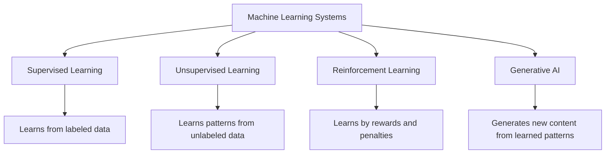

## 2. Quick Comparison

| Type | Learns From | Main Goal | Typical Output | Example |
|---|---|---|---|---|
| Supervised | Labeled data | Predict correct answer | Number or category | House price prediction |
| Unsupervised | Unlabeled data | Find hidden structure | Groups, clusters, embeddings | Customer segmentation |
| Reinforcement | Interaction with environment | Maximize reward | Action or policy | Game-playing agent |
| Generative AI | Large datasets of existing content | Create new content | Text, image, audio, video, code | Chatbot or image generator |

## 3. Supervised Learning

Supervised learning uses data where the correct answer is already known.

You provide:

- inputs
- target labels

The model learns the mapping:

`input -> correct output`

### Intuition

This is like learning from solved examples. If a model sees enough examples of inputs and their correct outputs, it can learn to predict the output for a new input it has never seen before.

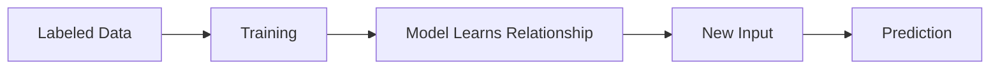

### Fast Mental Model

In supervised learning, each row of data usually looks like this:

- **Features**: the input values the model can use
- **Label**: the answer the model should learn to predict
- **Example**: one training row containing features and a label

Example:

| Example | Features | Label |
|---|---|---|
| House | area, bedrooms, zipcode | price |
| Email | sender, words, links | spam / not spam |
| Weather | temperature, humidity, pressure | rainfall amount |

### Core Workflow

The main points from the supervised learning workflow are:

1. Collect a **labeled dataset**
2. Train a model on examples with features and labels
3. Compare predictions with true answers
4. Adjust the model to reduce error
5. Evaluate on unseen labeled data
6. Use the trained model for **inference** on new unlabeled data

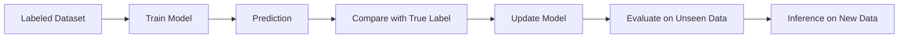

### Terms That Matter Most

- **Training**: the model learns from labeled examples
- **Loss**: how far the prediction is from the true answer
- **Evaluation**: testing how well the trained model works on unseen labeled data
- **Inference**: using the trained model to predict on new data

### What Makes a Good Dataset

The source page stresses two qualities:

- **Large enough**: enough examples to learn stable patterns
- **Diverse enough**: examples cover the different situations the model will face

Important idea:

- large but narrow data is risky
- diverse but too little data is also risky
- the best case is **large and diverse**

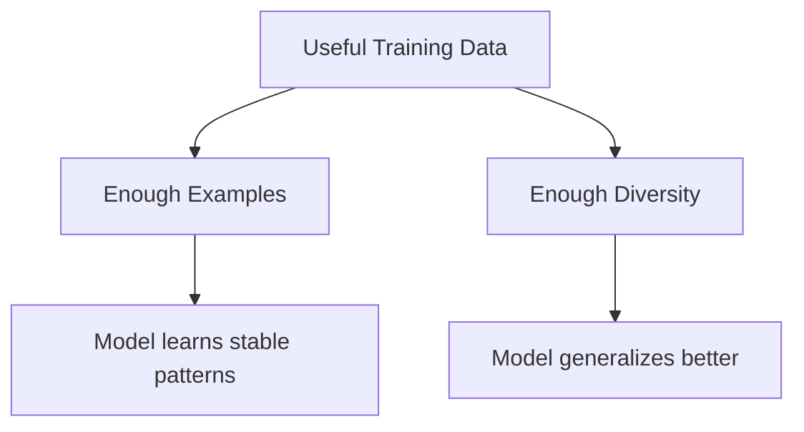

### Main Subtypes

#### 3.1 Regression

Use regression when the output is a **number**.

Examples:

- predicting house price
- forecasting rainfall amount
- estimating energy consumption
- predicting ride time

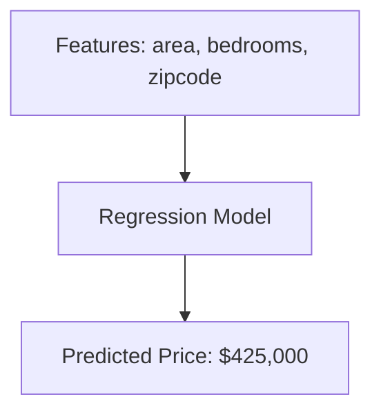

#### 3.1.1 Linear Regression

Linear regression is one of the simplest supervised learning models. It predicts a numeric value by fitting a straight-line relationship between input features and the target.

Fast idea:

- if the relationship looks roughly like a line, linear regression is a good first model
- it helps you understand how inputs influence the prediction
- it is often the baseline model before trying more complex models

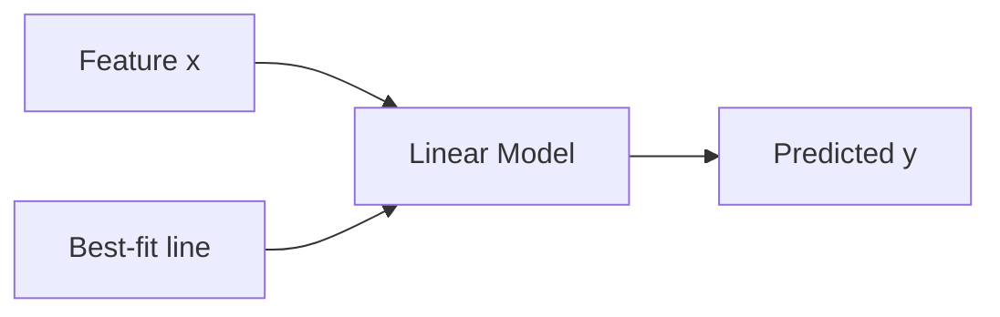

### Linear Regression Equation

For one feature, the model is written as:

`y' = b + w1x1`

What each part means:

- `y'`: predicted value
- `x1`: input feature
- `w1`: weight for that feature
- `b`: bias, also like the intercept

Simple interpretation:

- **weight** tells you how strongly the feature affects the prediction
- **bias** is the starting value before features shift the output

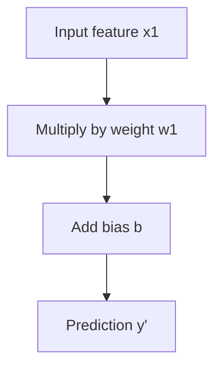

### Example

If you predict fuel efficiency from car weight, a linear regression model might learn that:

- heavier cars usually have lower miles per gallon
- lighter cars usually have higher miles per gallon

So the best-fit line summarizes the trend in the data.

### What Training Changes

During training, the model does **not** change the data. It updates:

- the **weight(s)**
- the **bias**

The goal is to reduce the gap between:

- predicted value
- actual value

This gap is captured by the **loss**.

### Linear Regression Loss

Loss tells us how bad the model's predictions are.

For a single example:

- **actual value** = the true label
- **predicted value** = the model output
- **error / residual** = actual value minus predicted value

If predictions are close to the real values, loss is low. If predictions are far away, loss is high.

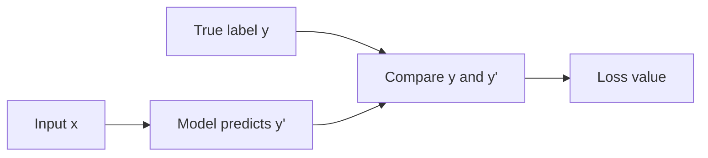

### Two Common Loss Functions

#### Mean Absolute Error (MAE)

MAE uses the absolute value of the error.

`MAE = average of |actual - predicted|`

Main idea:

- every error contributes in a linear way
- easier to interpret
- less sensitive to outliers than squared loss

#### Mean Squared Error (MSE)

MSE squares each error before averaging.

`MSE = average of (actual - predicted)^2`

Main idea:

- big mistakes get penalized much more heavily
- very common in linear regression training
- more sensitive to outliers

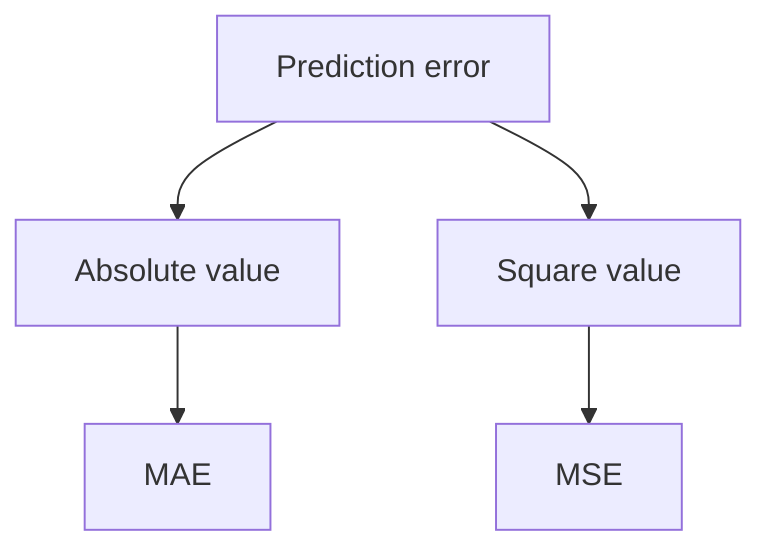

### Why Squared Loss Is Common

Squared loss is useful because:

- it strongly punishes large errors
- it gives a smooth optimization surface
- it works well with gradient-based training

Fast intuition:

- an error of 10 is much worse than two errors of 5 when using squared loss

### Outliers Matter

An **outlier** is a data point that is far from the rest.

Important effect:

- MAE is more robust to outliers
- MSE reacts strongly to outliers because squaring makes large errors dominate

So if your data has extreme values, your loss choice changes model behavior.

### Gradient Descent

Gradient descent is the method commonly used to reduce loss during training.

Main idea:

- start with some initial weight and bias values
- measure the current loss
- compute how to change the parameters to lower the loss
- update the parameters a little
- repeat many times

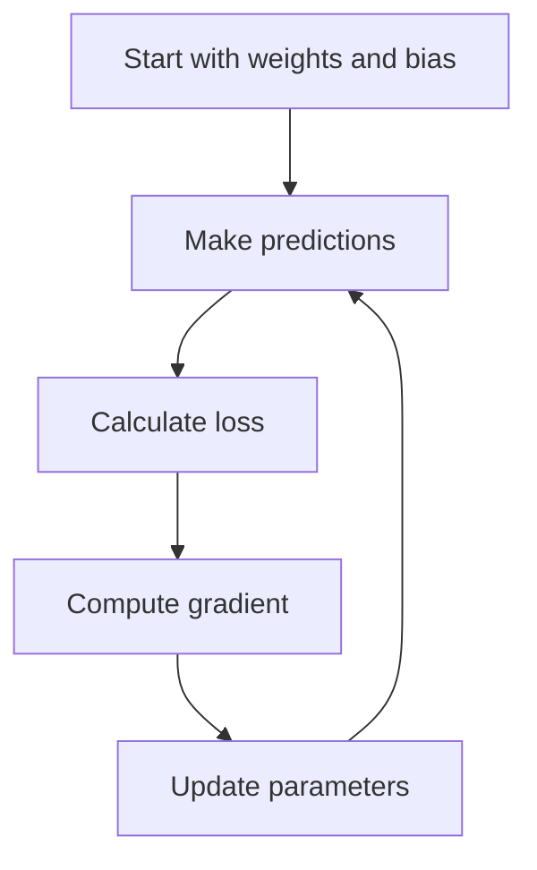

### Intuition

Think of the loss surface like a hill or bowl.

- gradient tells you which direction is uphill
- gradient descent moves in the opposite direction
- the goal is to move downhill toward the minimum loss

For linear regression with squared loss, the loss surface is typically bowl-shaped, which is useful because there is a single best minimum to move toward.

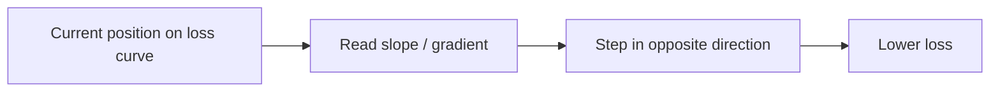

### Learning Rate

The **learning rate** controls how large each update step is.

This is one of the most important training settings.

- if the learning rate is too small, training is slow
- if it is too large, training may overshoot or diverge
- a good learning rate helps the model converge efficiently

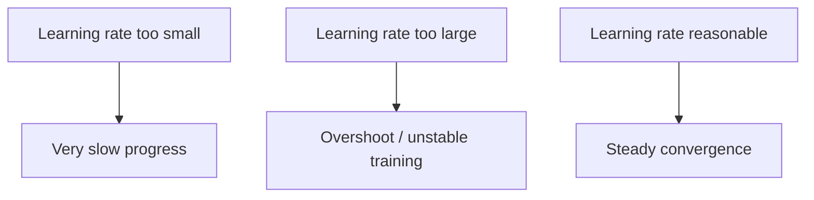

### Convergence

**Convergence** means the model is approaching a stable low-loss solution.

Signs of convergence:

- loss keeps decreasing
- updates become smaller
- the model stops improving much after many steps

### What Gradient Descent Updates

For linear regression, gradient descent updates:

- the **weights**
- the **bias**

It does this by following the gradient of the loss function with respect to those parameters.

### What to Remember

Gradient descent is: **repeatedly adjust weights and bias in the direction that reduces loss until the model reaches a low-loss solution**.

### Hyperparameters

Hyperparameters are training settings that **you choose** before or during training.

This is different from model parameters:

- **parameters**: values the model learns, such as weights and bias
- **hyperparameters**: values you set, such as learning rate, batch size, and epochs

Fast rule:

- parameters are learned by the model
- hyperparameters are chosen by the practitioner

### Three Main Hyperparameters

#### Learning Rate

The learning rate controls how big each gradient descent step is.

- too low: training is slow
- too high: training becomes unstable or fails to converge
- well chosen: training reaches low loss faster

#### Batch Size

Batch size is the number of examples used to compute one training update.

- small batch size: noisier updates, often lower memory use
- large batch size: smoother updates, often higher memory use

Main idea:

- batch size changes how often the model updates and how stable those updates feel

#### Epochs

An epoch is one full pass through the entire training dataset.

Examples:

- 1 epoch = the model has seen every training example once
- 10 epochs = the model has seen the training data ten times

Main idea:

- too few epochs may undertrain the model
- too many epochs may waste time or increase overfitting risk

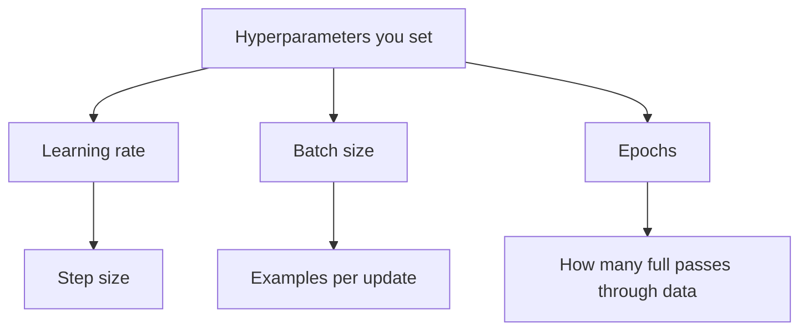

### How They Work Together

These hyperparameters interact with each other.

For example:

- a larger batch size may allow more stable updates
- a poor learning rate can ruin training even with good data
- more epochs only help if the updates are moving in a useful direction

### What to Remember

Hyperparameters are: **training controls you choose to help the model learn efficiently and converge well**.

### Multiple Features

Linear regression is not limited to one input feature.

With many features, the model becomes:

`y' = b + w1x1 + w2x2 + w3x3 + ...`

This means:

- each feature gets its own weight
- the final prediction combines their contributions

Examples of features for predicting fuel efficiency:

- car weight
- horsepower
- engine size
- acceleration
- number of cylinders

### What to Remember

Linear regression is: **predict a number by learning the best weights and bias for a line-like relationship between features and the label**.

#### 3.2 Classification

Use classification when the output is a **category**.

Examples:

- spam or not spam
- fraud or not fraud
- disease class
- weather type: rain, snow, hail

There are two common forms:

- **Binary classification**: two classes
- **Multiclass classification**: more than two classes

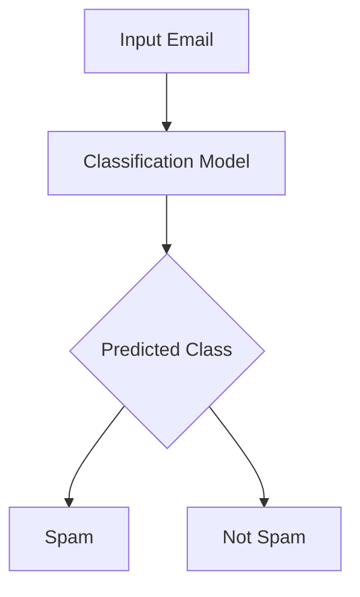

### When to Think “Supervised”

Choose supervised learning when:

- you already know what you want to predict
- you have historical examples with correct answers
- success can be measured against known outcomes
- you can clearly define the label

### One-Line Summary

Supervised learning is: **learn from labeled examples, evaluate on unseen labeled data, then predict for new unlabeled inputs**.

## 4. Unsupervised Learning

Unsupervised learning works on data **without labels**.

The model is not told the “correct answer.” Instead, it tries to find meaningful structure in the data.

### Intuition

If supervised learning answers:

`What should the output be?`

then unsupervised learning asks:

`What patterns already exist here?`

### Common Use: Clustering

Clustering groups similar data points together.

Examples:

- grouping customers by behavior
- identifying similar products
- discovering segments in sensor data
- finding natural patterns in weather data

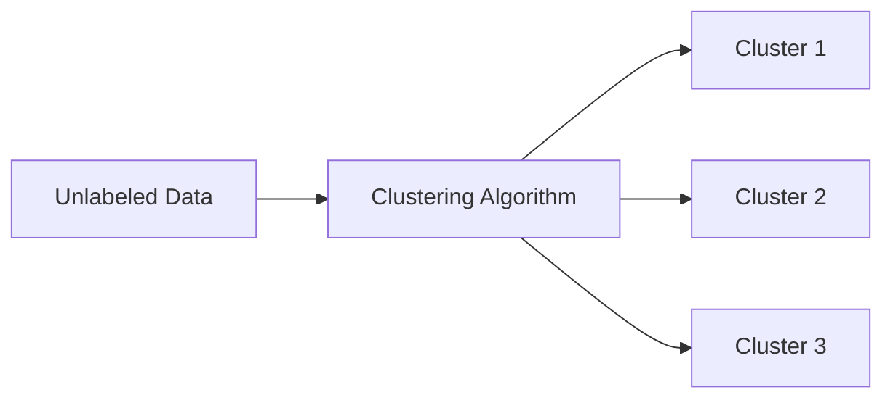

### Key Difference from Classification

Classification uses **predefined labels**.

Clustering finds **natural groupings** first, and humans may name those groups later.

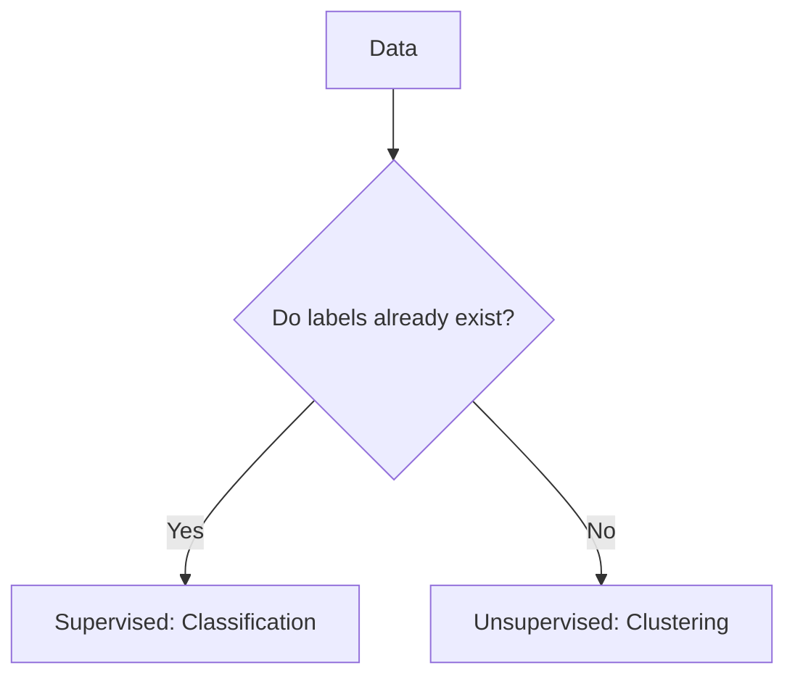

### When to Think “Unsupervised”

Choose unsupervised learning when:

- you do not have labels
- you want to discover structure or segments
- you are exploring data before building predictive systems

## 5. Reinforcement Learning

Reinforcement learning (RL) is about learning through interaction.

An agent takes actions in an environment and receives:

- rewards for good actions
- penalties for bad actions

The goal is to learn a **policy** that maximizes total reward over time.

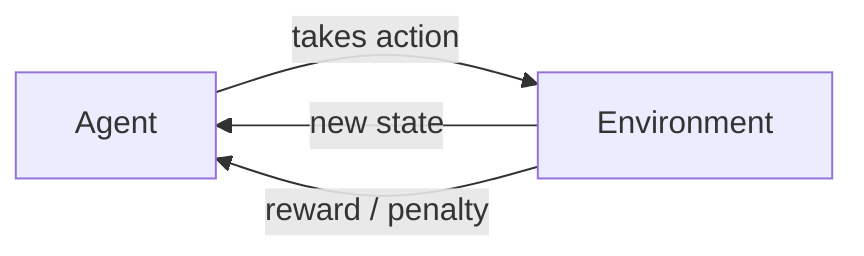

### Intuition

This is similar to training through trial and error. The system is not shown the exact right answer for every step. Instead, it gradually learns which actions lead to better long-term outcomes.

### Examples

- game playing
- robot movement
- resource allocation
- recommendation systems with feedback loops

### When to Think “Reinforcement”

Choose RL when:

- actions affect future states
- the system improves by interacting over time
- success depends on long-term reward, not one-step prediction

## 6. Generative AI

Generative AI creates **new content** by learning patterns from existing data.

Possible outputs include:

- text
- images
- audio
- video
- code

### Intuition

A generative model does not just choose from fixed labels. It produces a new output that resembles the patterns it learned during training.

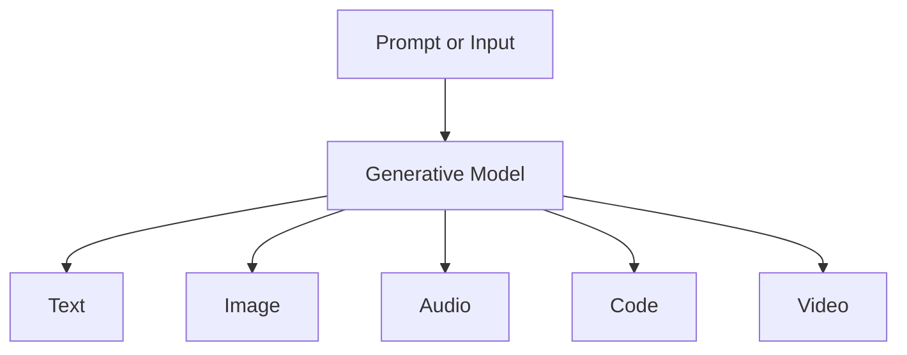

### Common Input -> Output Patterns

| Input | Output | Example |
|---|---|---|
| Text | Text | Summarization, Q&A |
| Text | Image | Image generation |
| Text | Code | Code generation |
| Image | Text | Captioning |
| Image + Text | Image | Image editing |

### Important Note

Generative AI is often discussed separately because its output is content creation, but conceptually it still belongs inside the broader ML world.

In practice, modern generative systems may use:

- unsupervised-style pretraining
- supervised fine-tuning
- reinforcement learning for alignment or optimization

## 7. How These Categories Relate

These categories are useful for learning, but real-world systems often combine them.

For example:

- a generative AI model may first learn patterns from raw data, then be tuned with supervised learning
- a recommendation system may use supervised models for click prediction and reinforcement learning for long-term engagement
- an ML project may begin with unsupervised analysis before moving into supervised prediction

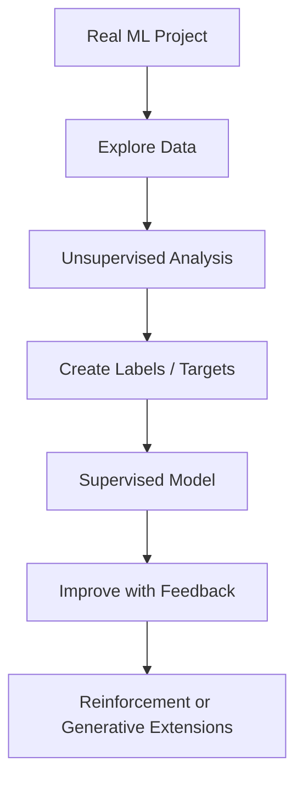

## 8. Simple Decision Guide

Use this mental shortcut:

```mermaid
flowchart TD
    A["What problem are you solving?"] --> B{"Do you have correct labels?"}
    B -->|Yes| C{"Do you predict a number or a category?"}
    C -->|Number| D["Regression"]
    C -->|Category| E["Classification"]
    B -->|No| F{"Do you want to discover structure?"}
    F -->|Yes| G["Unsupervised Learning"]
    F -->|No| H{"Do actions earn rewards over time?"}
    H -->|Yes| I["Reinforcement Learning"]
    H -->|No| J["Do you want to generate new content?"}
    J -->|Yes| K["Generative AI"]
```

## 9. What You Should Remember First

If you are just getting started, remember these four lines:

1. **Supervised learning** learns from labeled examples.
2. **Unsupervised learning** finds patterns without labels.
3. **Reinforcement learning** learns from rewards and penalties.
4. **Generative AI** creates new content from learned patterns.

## 10. Suggested Next Step for Your Project Notes

A clean way to continue building this learning document is:

1. Types of ML systems
2. Supervised learning in detail
3. Regression vs classification
4. Data, features, and labels
5. Training, validation, and testing
6. Model evaluation metrics
7. Overfitting and underfitting
8. End-to-end ML workflow

## Source

- [Google for Developers: What is Machine Learning?](https://developers.google.com/machine-learning/intro-to-ml/what-is-ml)
