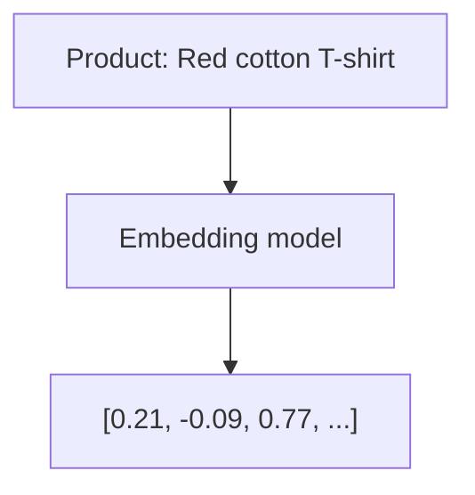
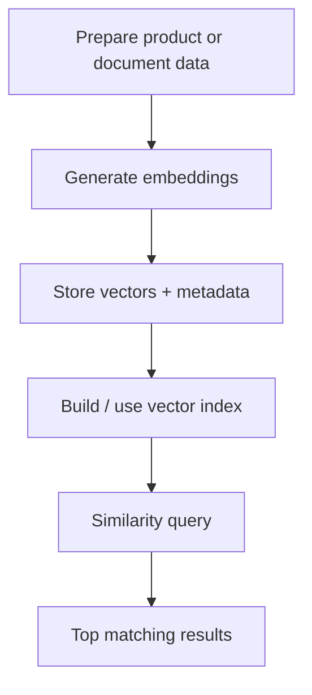

# Getting Started With Vector Databases

This is a short study note based on DZone's refcard, focused only on the ideas that matter for understanding vector databases quickly.

Source: [DZone Refcard: Getting Started With Vector Databases](https://dzone.com/refcardz/getting-started-with-vector-databases)

## 1. What a Vector Database Is

A vector database is built to store and search data using **vector embeddings** instead of only exact field matches.

Use it when the question is more like:

- "What is similar to this?"
- "What has the same meaning?"
- "What content is closest in context?"

instead of:

- "What row exactly matches this value?"

## 2. Why Vector Databases Exist

Traditional databases are excellent for:

- exact lookups
- filters
- joins
- structured business records

Vector databases are useful for:

- semantic search
- recommendations
- similarity matching
- retrieval for AI systems

Main idea:

- relational databases answer exact questions well
- vector databases answer similarity and meaning-based questions well

## 3. The Core Concept: Embeddings

An **embedding** is a list of numbers representing an object in a high-dimensional space.

That object could be:

- text
- a document
- an image
- audio
- video
- a product description

Important point:

- objects with similar meaning should end up closer together in vector space

## 4. Metadata Still Matters

A vector database usually stores more than embeddings.

It also stores **metadata**, such as:

- product name
- category
- color
- tags
- document id
- source

This matters because real applications often need both:

- similarity search on vectors
- filtering on normal fields

Example:

- "Find shirts similar to this one"
- but also "only in men's category" and "only red or green"

## 5. Similarity and Distance

Vector search works by measuring how close two embeddings are.

Common metrics:

- **Cosine similarity**
- **Euclidean distance**
- **Manhattan distance**

Fast intuition:

- smaller distance or higher similarity means more related results
- the metric you use affects search behavior
- a good rule is to use the metric that matches the embedding model's design/training

## 6. Why Indexes Matter

Searching every vector one by one is too slow at scale.

So vector databases use **vector indexes** to make nearest-neighbor search practical.

Examples mentioned in the refcard:

- ANN (Approximate Nearest Neighbor)
- inverted index
- LSH (Locality-Sensitive Hashing)

Main point:

- indexes trade exactness for speed when needed
- this is usually necessary for large, high-dimensional datasets

## 7. Why Use a Vector Database Instead of a Library

You can store embeddings with libraries or in-memory indexes, but a vector database adds system-level features needed for production.

Important advantages:

- persistence and durability
- high availability
- horizontal scalability
- security and access control
- APIs and SDKs
- CRUD operations on vectorized objects
- vector + metadata querying together

This is the difference between:

- a search technique
- and a production-ready data platform

## 8. Main Use Cases

### Semantic Search

Semantic search finds results by meaning, not just keyword overlap.

Examples:

- product search
- customer support search
- internal knowledge search
- recommendations

### RAG for Generative AI

Retrieval-augmented generation (RAG) uses external knowledge to improve LLM responses.

A vector database helps by:

- storing document embeddings
- retrieving relevant chunks for a prompt
- supplying fresh context to the model

Why this matters:

- LLMs are not always current
- retraining is expensive
- RAG adds relevant information at query time

## 9. Practical Workflow

The refcard walks through a retail example. The exact tool used is Weaviate, but the broader workflow is the important part.

### Basic Flow

1. Run a vector database locally or in the cloud
2. Prepare source data
3. Convert objects into embeddings
4. Store vectors plus metadata in a collection
5. Query using similarity search
6. Return the closest matching items

## 10. What to Remember

If you only remember five things, remember these:

1. Vector databases are for **similarity and semantic search**, not just exact matching.
2. They store **embeddings**, which are numeric representations of meaning.
3. They usually combine **vectors + metadata** for practical querying.
4. They depend on **distance metrics** and **indexes** to search efficiently.
5. They are a key building block for **semantic search, recommendations, and RAG**.

## 11. One-Line Summary

A vector database is a production-ready system for storing embeddings and retrieving the most semantically similar items quickly and at scale.
