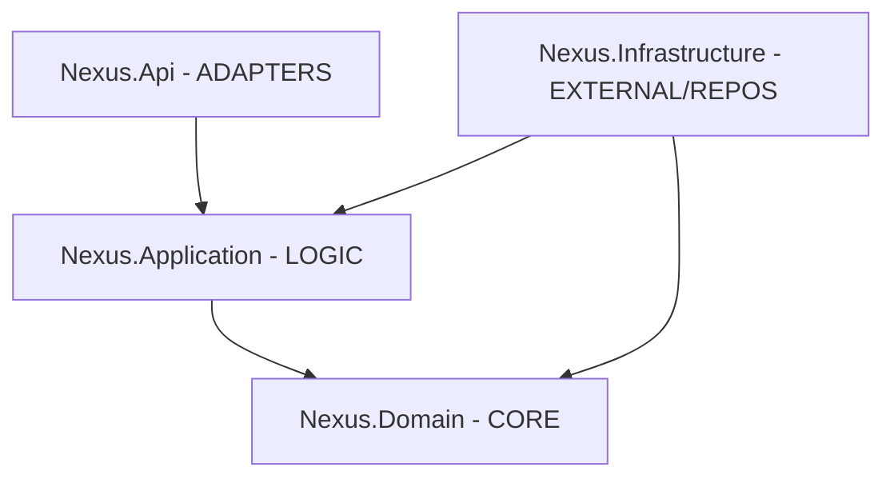

# 🏗️ Nexus Project Architecture: CLEAR

This project is built using the **CLEAR Architecture** pattern, ensuring a strict separation of concerns and independent testability.

| Layer                | Description                                           | Project Location               |
|----------------------|-------------------------------------------------------|--------------------------------|
| **C - Core**         | Business Entities, Value Objects, Domain Logic.       | `Nexus.Domain/`                |
| **L - Logic**        | Application Services, Use Cases, DTOs, Mapping.        | `Nexus.Application/`           |
| **E - External**     | Database context (EF Core), File System, Cloud APIs. | `Nexus.Infrastructure/`        |
| **A - Adapters**     | Web Controllers, Web API, Minimal API endpoints.      | `Nexus.Api/`                   |
| **R - Repositories** | Data access abstractions and concrete implementations. | `Nexus.Infrastructure/` (impl) |

---

## 🗺️ Visual Mapping

## 🧠 Why CLEAR + DDD?
By using **CLEAR Architecture** as the structural framework and **DDD** as the modeling strategy, the Nexus project remains:
- **Testable**: You can test business logic without a database.
- **Framework Agnostic**: We can swap EF Core for Dapper or even change the Web Host without touching the Domain.
- **Scalable**: Adding a new feature doesn't compromise the existing code integrity.

---

## 📐 Entity Coding Standards (The "Gold Standard")
To maintain a high-quality codebase, every Domain Entity in Nexus should follow these specific patterns (see `Account.cs` for a reference):

### 1. Encapsulated Properties
- Use **private setters** (`public string Prop { get; private set; }`).
- Never allow external modification of internal state without a domain method.

### 2. Double-Constructor Strategy
- **Private Parameterless Constructor**: Required for EF Core. Initialize non-nullable strings with `null!` to satisfy the compiler while acknowledging EF Core's role.
- **Public Domain Constructor**: Use this for initial instantiation. It should validate all mandatory inputs.

### 3. Rich Domain Behavior
- Avoid "Anemic Models" (entities with only data).
- Business logic (like `Debit` or `Credit`) belongs inside the entity, ensuring it always remains in a valid state.

---

*Refer to [interview.md](./interview.md) for detailed interview preparation notes on this architecture.*
