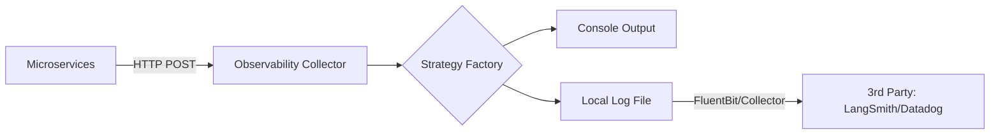

# Observability Architecture: Corporate Design

This service is the central nervous system for the Playbook, responsible for collecting, buffering, and routing telemetry data from all microservices.

## Core Design Principles

### 1. Unified Ingestion (Collector Pattern)
Unlike simple "print" logging, this service acts as a **Collector**. Other services (RAG, Gateway, Agents) "ship" their data to this service over HTTP. This decouples the business logic from the storage/analysis backend.

### 2. Industry Standard Data Models
- **Logs**: JSON-structured messages including `service_name`, `level`, and `trace_id`.
- **Metrics**: Key-Value pairs with timestamps (e.g., `llm_token_count=150`).
- **Traces**: Start and End spans that allow following a request through multiple services.

### 3. Integrated Audit Logging
The collector itself is audited. Every ingestion request is logged with its own latency and status code, ensuring that the monitoring layer doesn't become a performance bottleneck.

## Component Flow

## Strategy Implementation (`app/services/factory.py`)
- **`ConsoleIngestionStrategy`**: Best for local debugging.
- **`FileIngestionStrategy`**: Standard corporate pattern. Logs are buffered to a local file which is then "scraped" by a log shipper (like FluentBit or Datadog Agent) to minimize network overhead on the main application threads.
