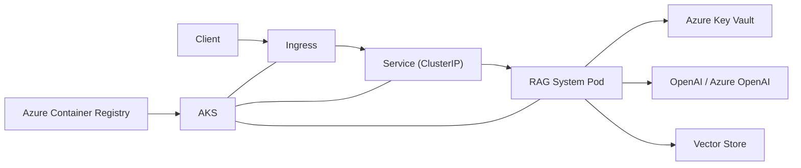

# RAG System AKS Architecture

High-level flow:

Expected runtime dependencies:
- ingress for public access
- Key Vault for secrets
- external LLM provider
- vector store backend

Ingress:
- public traffic in

Egress:
- outbound calls to LLM, Key Vault, and vector store
