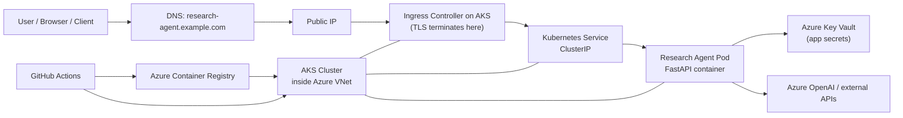

# Research Agent AKS Architecture

## Ingress vs Egress

### Ingress

Ingress is traffic coming **into** your application from outside the cluster.

In this deployment, ingress flow is:

1. A client calls `https://research-agent.example.com`
2. DNS resolves that hostname to the public IP of the AKS ingress controller
3. The ingress controller receives the request
4. TLS terminates there using the configured certificate
5. The ingress rule forwards the request to the Kubernetes Service
6. The Service forwards traffic to one of the `research-agent` pods

Ingress is therefore the controlled entry path from the internet into your service.

### Egress

Egress is traffic going **out** from your pods to external systems.

Examples for this project:
- calling Azure OpenAI
- calling Tavily or other external web/search APIs
- calling Azure Key Vault through the CSI provider
- pulling the container image from ACR

Egress is therefore the controlled exit path from your workloads to other services.

## Network Mental Model

Your AKS cluster runs inside Azure virtual networking. If you come from AWS, the closest mental mapping is:

- Azure VNet ~= AWS VPC
- Azure Subnet ~= AWS Subnet
- Azure Load Balancer ~= AWS Load Balancer
- NSG ~= Security Group / subnet network rules combination

The application usually sits in pods on AKS nodes, and those nodes are attached to subnets in a VNet. Public traffic normally does not go directly to the pod. It goes through an ingress controller or load balancer first.

## Architecture Diagram

## Traffic Explanation

### Inbound traffic

- Public internet traffic reaches the ingress public IP
- Ingress routes by hostname/path
- The Kubernetes Service exposes the pods internally
- Pods themselves stay behind the service

### Outbound traffic

- Pods make outbound HTTPS calls to Azure APIs and external APIs
- The cluster or node networking handles egress routing
- In more advanced setups, you can restrict egress with firewall, NSG, or private endpoints

## Why Use Ingress Instead Of Only LoadBalancer

If you expose the app directly as `Service type: LoadBalancer`, Azure creates a public load balancer entry straight to that service.

That is fine for simple cases, but ingress is better when you want:
- hostname-based routing
- multiple services behind one entry point
- centralized TLS termination
- cleaner HTTP routing
- fewer public endpoints

## Recommended First Production Shape

- AKS in a VNet
- `research-agent` exposed through ingress
- TLS at ingress
- app service itself as `ClusterIP`
- secrets from Key Vault
- image from ACR
- outbound calls restricted later as you harden the environment

## Node Resource Group (Managed Infrastructure)

When you deploy AKS, Azure automatically creates a second resource group (prefixed with `MC_`) to house the underlying infrastructure required by the Kubernetes cluster. These resources are managed by the AKS service.

| Resource Type | Purpose |
| :--- | :--- |
| **Virtual Machine Scale Set (VMSS)** | The actual compute nodes where your Kubernetes pods are scheduled and run. |
| **Virtual Network (VNet) & Subnet** | The private network that allows nodes and pods to communicate with each other. |
| **Network Security Group (NSG)** | Defines the firewall rules for the nodes (e.g., allowing traffic from the load balancer). |
| **Load Balancer** | Handles inbound traffic from the internet and distributes it to the correct nodes. |
| **Public IP Address** | The entry point for external traffic to reach the Load Balancer / Ingress. |
| **Managed Identities** | Automated identities used by AKS components (like the Key Vault CSI driver) to securely access other Azure services. |

> [!NOTE]
> You should generally not modify resources inside the `MC_` resource group directly. AKS handles their lifecycle, and they will be automatically deleted when the AKS cluster is destroyed.
